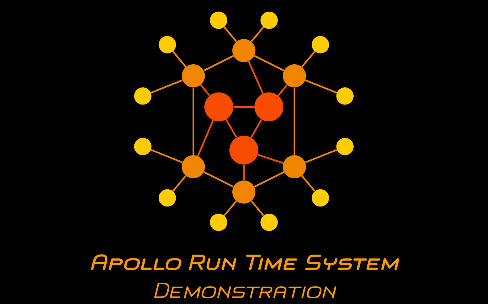
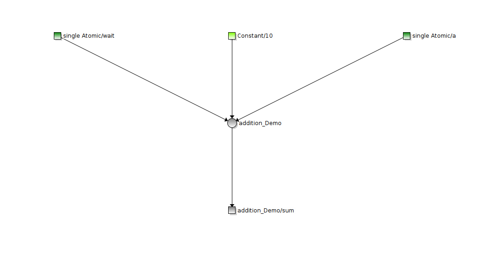
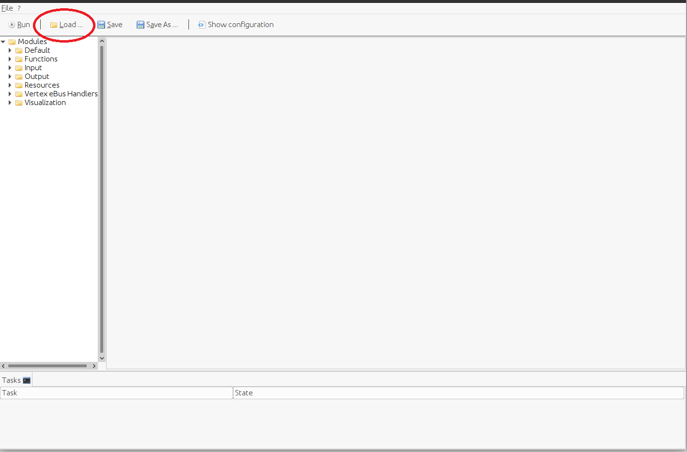
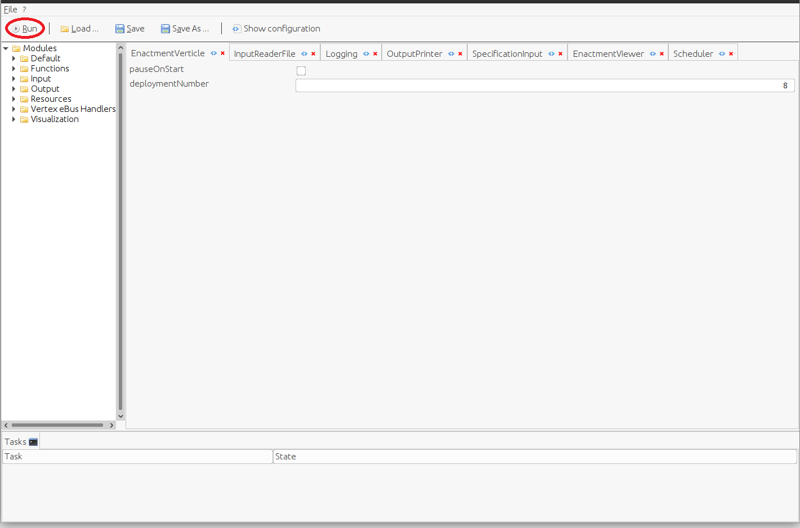
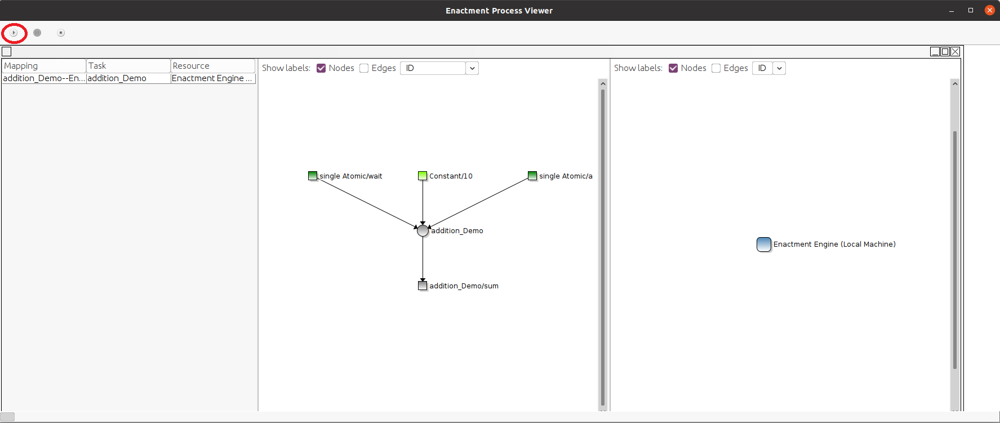
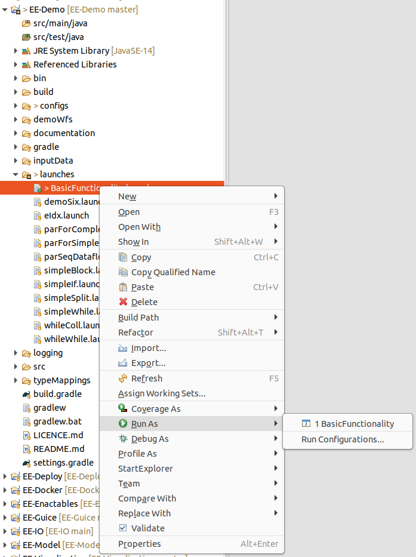

# Basic Functionality Demonstration

This demonstration provides the quickest and simplest way to run an application orchestration. This documentation details the steps necessary to run the demonstration and provides an explanation of Apollo's configuration GUI and orchestration visualization.

--------------------------------------

## Video
The contents of this demonstration are also provided as a Youtube video (click the image):

[](https://www.youtube.com/watch?v=KFoT99tpJBk)


----------------------------------
## Prerequisites

- Java (11+)
- [Gradle](https://gradle.com/)

---------------------------------------

## What is being demonstrated

This demonstration consists of the orchestration of a simple application consisting of a single function which is provided with an input and produces an output. The following image illustrates the enactment graph of the application:

<p align="center">

</p>

In order to keep the setup maximally leightweight for this demo, the function is executed directly by Apollo, so that no other resources are necessary.

--------------------------------

## Setup

Execute the following steps to run the demonstration (instructions provided for Linux):

1. Clone the [EE-Demo](https://github.com/Apollo-Core/EE-Demo) repository to a folder of your choosing:

```
git clone git@github.com:Apollo-Core/EE-Demo.git

cd EE-Demo
```

2. Execute the *gradle build* command. This will download and configure all required dependencies:

```
gradlew build
```

2. a) [Optional] Execute the *gradle eclipse* command to configure an Eclipse project which can be directly imported from the directory you clone the repository into:

```
gradlew eclipse
```

2. b) [Optional] In case you want to execute the project from Eclipse:
      1. Open Eclipse
      2. Click on *File -> Import -> Existing Projects into Workspace*
      3. Click *Browse* and navigate to the directory containing EE-Demo
      4. Make sure that Eclipse detects a Java project named EE-Demo and click *Import*

--------------------  

## Running the Demonstration (the steps in the Setup section must be executed first)

### Option A: Running the demonstration from the (Linux) console:

1. Execute the *gradle run* command:

```
gradlew run
```

2. The *gradle run* command will open up the Apollo Configuration GUI, which is initially empty. To load the configuration of the basic demonstration, click on the *Load...* button and navigate load the configuration found at *[directory where you placed EE-Demo]/configs/BasicFunctionality.xml*:

<p align="center">

</p>

3. Click the *Run* button in the configuration GUI:

<p align="center">

</p>

4. Click the *Play* button to start the orchestration:

<p align="center">

</p>

### Option B: Running the demonstration from Eclipse:

1. Make sure you executed steps 2. a) and 2 b) from the setup section.

2. In Eclipse, open the *launches* folder inside the *EE-Demo* project, right-click the file *BasicFunctionality.launch*, and select *Run as -> Basic Functionality*:

<p align="center">

</p>

3. Click the *Run* button in the configuration GUI (same as step 3 in Option A) and then the *Play* button in the orchestration GUI (same as step 4 in Option A).